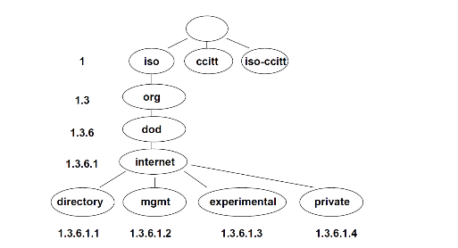
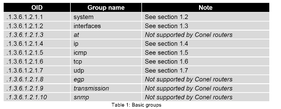

# Table of Contents

1. [Tai liệu về OID](#tailieuveoid)
2. [Installation](#installation)
3. [Usage](#usage)
4. [Contributing](#contributing)
5. [License](#license)

## Tài liệu về OID 

- [Tài liệu về OID](./Aplication_Guide_SNMP%20OID.pdf)
  > Đại khái là OID (Object Identifier) là một chuỗi mã duy nhất để xác định một object. Object là dạng dữ liệu đơn giản (text,...) chứa 1 thông tin nào đó (vd: Tên thiết bị). 
  
  > Vd: OID .1.3.6.1.2.1.1.5.0 là sysName (Tên của thiết bị).

  > Mỗi thiết bị mạng thì hén được cấu hình sẵn một số mã oid cho nó rồi, tuỳ các thiết bị khác nhau mà nó sẽ có tập mã oid khác nhau. Khi mà cái đứa quản lý gởi request snmp có mã oid tới thiết bị mạng, nếu mà thiết bị đó có cấu hình mã oid nớ thì nó sẽ trả response có thông tin về cho đứa quản lý, còn không thì nó sẽ báo lỗi về.

  > .

  > Mà thường sẽ luôn có dãy mã oid từ 1.3.6.1.2 (mgmt - management) trở xuống (chắc là quy ước chung), có khi rõ trong tài liệu á. 1.3.6.1.4 (private) là dãy mã dành riêng cho mấy công ty tạo ra thiết bị mạng đó tự định nghĩa.

  

## Installation 

[Ở đây là nội dung hướng dẫn cài đặt]

## Usage 

[Ở đây là nội dung hướng dẫn sử dụng]

## Contributing 

[Ở đây là nội dung hướng dẫn đóng góp]

## License 

[Ở đây là thông tin về giấy phép]
